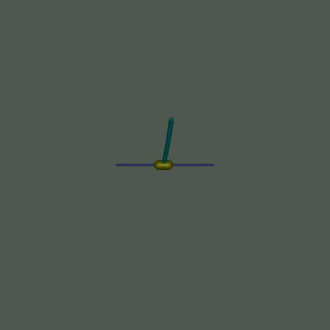
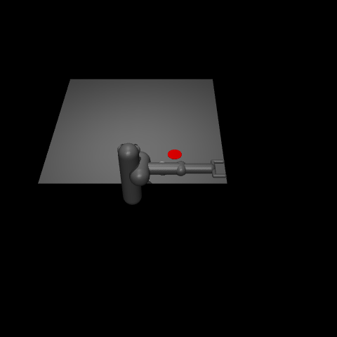
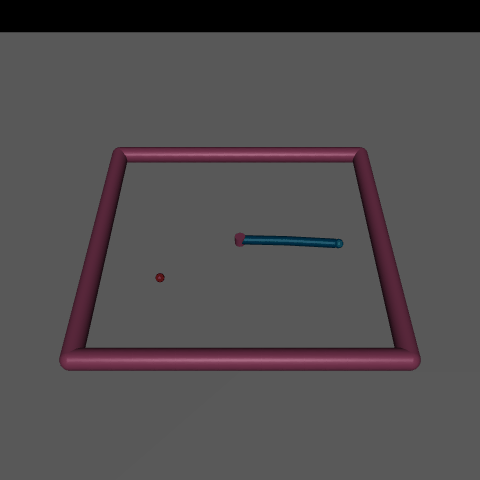

## Introduction
This project implements the Soft Actor-Critic (SAC) algorithm and tests it in MuJoCo environments.

### Environment setup
Install Python 3.10 (Anaconda is recommended)
```
conda create -n sac_mujoco python=3.10
```

Install dependencies
```
pip install -r requirements.txt
```

### Training
Train the agent
```
python main.py --env_name 'Ant-v5'
```

Generate a GIF
```
python render.py --env_name 'Ant-v5' --load_checkpoint 300000
```

### Results
The author did not fine-tune hyperparameters for each environment, so the agent performs especially well only in some environments. Results are shown below:
<p align="center">
  <figure style="display:inline-block; text-align:center; margin:10px;">
    
    <figcaption>Ant-v5</figcaption>
  </figure>
  <figure style="display:inline-block; text-align:center; margin:10px;">
    
    <figcaption>HalfCheetah-v5</figcaption>
  </figure>
  <figure style="display:inline-block; text-align:center; margin:10px;">
    
    <figcaption>Hopper-v5</figcaption>
  </figure>
</p>

<p align="center">
  <figure style="display:inline-block; text-align:center; margin:10px;">
    
    <figcaption>Humanoid-v5</figcaption>
  </figure>
  <figure style="display:inline-block; text-align:center; margin:10px;">
    
    <figcaption>HumanoidStandup-v5</figcaption>
  </figure>
  <figure style="display:inline-block; text-align:center; margin:10px;">
    
    <figcaption>InvertedDoublePendulum-v5</figcaption>
  </figure>
</p>

<p align="center">
  <figure style="display:inline-block; text-align:center; margin:10px;">
    
    <figcaption>InvertedPendulum-v5</figcaption>
  </figure>
  <figure style="display:inline-block; text-align:center; margin:10px;">
    
    <figcaption>Pusher-v5</figcaption>
  </figure>
  <figure style="display:inline-block; text-align:center; margin:10px;">
    
    <figcaption>Reacher-v5</figcaption>
  </figure>
</p>

<p align="center">
  <figure style="display:inline-block; text-align:center; margin:10px;">
    
    <figcaption>Swimmer-v5</figcaption>
  </figure>
  <figure style="display:inline-block; text-align:center; margin:10px;">
    
    <figcaption>Walker2d-v5</figcaption>
  </figure>
</p>


