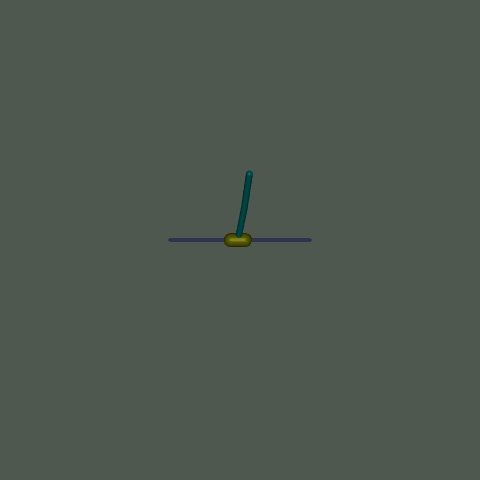
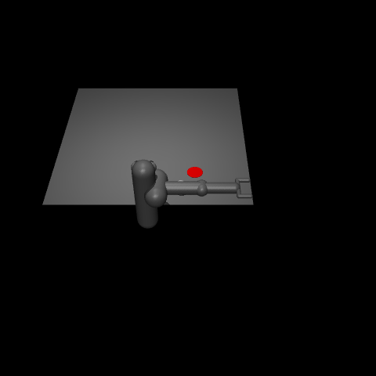

## 简介
此项目实现了Soft Actor Critic算法，并在mujoco环境中进行了测试。

### 环境配置
安装Python3.10（需要安装anaconda）
```
conda create -n sac_mujoco python=3.10
```

安装依赖
```
pip install -r requirements.txt
```

### 训练
训练智能体
```
python main.py --env_name 'Ant-v5'
```

产生gif
```
python render.py --env_name 'Ant-v5' --checkpoint 300000
```

### 结果
作者未针对环境进行超参数的微调，只有部分环境下智能体的性能比较突出。结果如下：
<p align="center">
  <figure style="display:inline-block; text-align:center; margin:10px;">
    
    <figcaption>Ant-v5</figcaption>
  </figure>
  <figure style="display:inline-block; text-align:center; margin:10px;">
    
    <figcaption>HalfCheetah-v5</figcaption>
  </figure>
  <figure style="display:inline-block; text-align:center; margin:10px;">
    
    <figcaption>Hopper-v5</figcaption>
  </figure>
</p>

<p align="center">
  <figure style="display:inline-block; text-align:center; margin:10px;">
    
    <figcaption>Humanoid-v5</figcaption>
  </figure>
  <figure style="display:inline-block; text-align:center; margin:10px;">
    
    <figcaption>HumanoidStandup-v5</figcaption>
  </figure>
  <figure style="display:inline-block; text-align:center; margin:10px;">
    
    <figcaption>InvertedDoublePendulum-v5</figcaption>
  </figure>
</p>

<p align="center">
  <figure style="display:inline-block; text-align:center; margin:10px;">
    
    <figcaption>InvertedPendulum-v5</figcaption>
  </figure>
  <figure style="display:inline-block; text-align:center; margin:10px;">
    
    <figcaption>Pusher-v5</figcaption>
  </figure>
  <figure style="display:inline-block; text-align:center; margin:10px;">
    
    <figcaption>Reacher-v5</figcaption>
  </figure>
</p>

<p align="center">
  <figure style="display:inline-block; text-align:center; margin:10px;">
    
    <figcaption>Swimmer-v5</figcaption>
  </figure>
  <figure style="display:inline-block; text-align:center; margin:10px;">
    
    <figcaption>Walker2d-v5</figcaption>
  </figure>
</p>